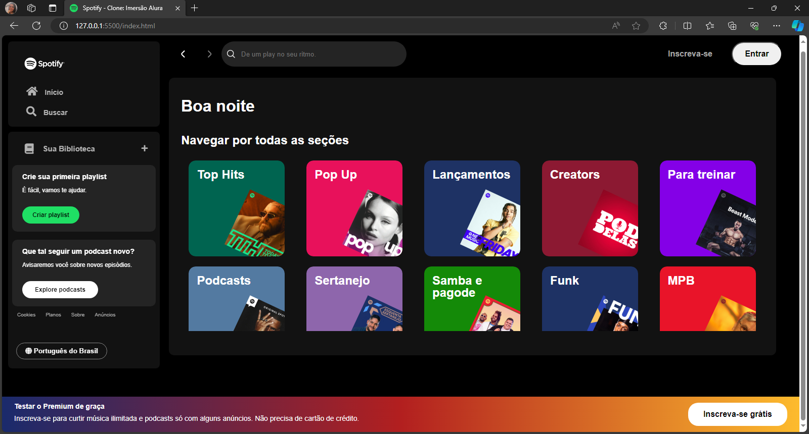

# Imersão Front-end Alura 2024 - Spotify Clone

## Projeto

Desenvolvimento da landing page do Spotify durante a Imersão Front-end da Alura. Foram abordados conceitos fundamentais de HTML, CSS e JavaScript, com o uso de ferramentas modernas.

## Tecnologias e Ferramentas Utilizadas

- **HTML**
- **CSS (Flexbox, Grid)**
- **JavaScript (Manipulação do DOM)**
- **Json-Server para simular uma API fictícia**

## Instrutores

- Guilherme Lima
- Fernanda Degolin
- Mayara Cardoso

## Autora do Projeto

- Camila Medeiros

## Screenshot

